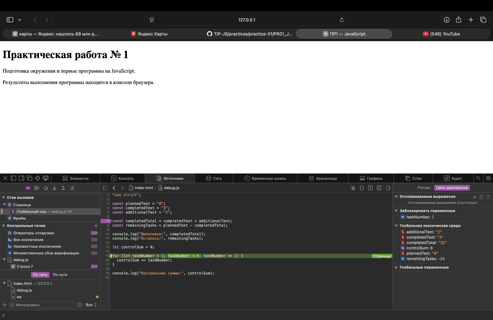

## Практическая работа №1

**Тема**: Подготовка окружения и первые программы на JavaScript

## Автор

* ФИО: Хегай Владимир Евгеньевич
* Группа: ЭФБО-04-25
* Вариант: 6

## Окружение

* ОС: macOS Tahoe 26.5.1
* Node.js: v24.15.0
* npm: 11.12.1
* git: 2.39.5 (Apple Git-154)
* Браузер: Safari

## Запуск

Все команды выполняются из корня репозитория `tip-js-practices`.

### Основные задания

```bash
node practice-01/js/hello.js
node practice-01/js/types.js
node practice-01/js/progress.js
node practice-01/js/plan.js
node practice-01/js/debug.js
node practice-01/js/progress-input.js

### Фактический ввод/вывод консоли

```text
vladimirhegai@MacBook-Air-Vladimir-8 tip-js-practices % node --version
npm --version
git --version
v24.15.0
11.12.1
git version 2.39.5 (Apple Git-154)
```

## Задание №1

Файл `hello.js` был запущен двумя способами:
* Node.js
* Браузер

### Node.js

Файл был запущен командой из терминала:
```bash
node practice-01/js/hello.js
```

Вывод программы появился в терминале:

```text
Студент: Хегай Владимир Евгеньевич
Группа: ЭФБО-04-25
Практическая работа: 1
JavaScript успешно запущен
Тип document: undefined
```

### Браузер

Файл `hello.js` был подключен к `index.html` с помощью тега `<script>`. После открытия страницы с помощью расширения Live server (можно было и без него, но оно у меня уже установлено) вывод программы появился в консоли разработчика (Разработка -> показать консоль JavaScript), а не на самой странице.

Вывод программы:

```text
[Log] Студент: Хегай Владимир Евгеньевич (hello.js, line 7)
[Log] Группа: ЭФБО-04-25 (hello.js, line 8)
[Log] Практическая работа: 1 (hello.js, line 9)
[Log] JavaScript успешно запущен (hello.js, line 10)
[Log] Тип document: – "object" (hello.js, line 11)
```

### Различие

При запуске через Node.js последняя строка содержит `undefined`, а при запуске в браузере содержит `object`.

Это происходит из-за того, что браузер предоставляет средства работы со страницей, в частности объект `document`. Обычный запуск файла через Node.js не создаёт HTML-страницу и не предоставляет браузерный DOM


## Задание №2

Для каждого выражения предварительно было сделано предположение о результате работы программы. После этого выражения были проверены в файле types.js через console.log().

Файл запускался через Node.js командой:

```bash
node practice-01/js/types.js
```

Также работа файла была проверена в браузере через консоль разработчика. 
Для этого в файле `index.html` была изменена часть кода с 
```text
"./js/hello.js"
```
на
```text
"./js/types.js"
```

### Результаты

| Выражение        | Ожидание до запуска | Фактическое значение | Тип результата | Объяснение                                                                                                                                               |
|------------------|---------------------|----------------------|:--------------:|----------------------------------------------------------------------------------------------------------------------------------------------------------|
| "8" + 2          | "82"                | "82"                 | string         | Если один из элементов суммы является строкой, то и второй преобразуется в строку                                                                        |
| "8" - 2          | 6                   | 6                    | number         | При разности если возможно, то первая строка переводится в тип данных `Number` и из него вычитается последующее число                                    |
| Number("8") + 2  | 10                  | 10                   | number         | Number("8") - переводит строку "8" в число 8, а после прибавляется 2                                                                                     |
| "12" > "3"       | false               | false                | boolean        | Поразрядно сравнивается строка (1 элемент 1 значения с 1 элементам 2 значения). Сравнивается до 1 различия. Все знаки сравниваются по кодировке Unicode |
| 12 === "12"      | false               | false                | boolean        | Идет сравнение данных. 12 в строковом формате не равно 12 в числовом                                                                                     |
| Number("")       | null                | 0                    | number         | При преобразовании пустой строки функция Number() возвращает 0                                                                                           |
| Number("text")   | Nan                 | NaN                  | number         | Попытка преобразования текста без чисел дает отсутствие числа                                                                                            |
| Boolean("false") | true                | true                 | boolean        | Функция выдает значение `true` при наличии любого содержания внутри                                                                                      |
| typeof null      | null                | object               | string         | `typeof null` выдает `object` - историческая особенность. А результат `typeof` - `string`                                                                |
| typeof NaN       | number              | number               | string         | `Nan` - число без числа и его формат - `number`, а вот формат значения - `string`                                                                        |


## Задание № 3

### Проверки

| Проверка            | Входные данные | Ожидаемый результат                             | Фактический результат                                                       | Итог     |
| ------------------- | -------------- | ----------------------------------------------- | --------------------------------------------------------------------------- | -------- |
| Обычный случай      | `12, 5`        | Осталось 7; прогресс 41.7%; статус `В работе`   | Осталось 7; прогресс 41.7%; статус `В работе`                               | Пройдено |
| Граничный случай    | `0, 0`         | `Задач пока нет`, процент не рассчитывается     | `Задач пока нет`                                                            | Пройдено |
| Граничный случай    | `5, 0`         | Осталось 5; прогресс 0.0%; статус `Не начато`   | Осталось 5; прогресс 0.0%; статус `Не начато`                               | Пройдено |
| Граничный случай    | `5, 5`         | Осталось 0; прогресс 100.0%; статус `Завершено` | Осталось 0; прогресс 100.0%; статус `Завершено`                             | Пройдено |
| Некорректные данные | `5, 6`         | Ошибка: выполнено больше общего количества      | `Ошибка: кол-во выполненных задач не может быть больше общего кол-ва задач` | Пройдено |
| Некорректные данные | `-1, 0`        | Ошибка: отрицательное количество                | `Ошибка: кол-во задач не может быть отрицательным`                          | Пройдено |
| Некорректные данные | `5, 2.5`       | Ошибка: дробное количество                      | `Ошибка: кол-во выполненных задач должно быть целым числом`                 | Пройдено |
| Некорректные данные | `"5", 2`       | Ошибка: вместо числа передана строка            | `Ошибка: кол-во задач должно быть числом`                                   | Пройдено |
| Некорректные данные | `1001, 0`      | Ошибка: превышена верхняя граница               | `Ошибка: кол-во задач не может быть больше 1000`                            | Пройдено |
| Некорректные данные | `NaN, 0`       | Ошибка: недопустимое числовое значение          | `Ошибка: кол-во задач должно быть числом`                                   | Пройдено |
| Мой вариант | `18, 6` | Осталось 12; прогресс 33.3%; статус `В работе` | Осталось 12; прогресс 33.3%; статус `В работе` | Пройдено |


## Задание № 4

В программе рассчитывается план выполнения оставшихся задач по дням с учётом максимального количества задач, которое можно выполнить за один день.

Для расчёта используется цикл `while`. На каждой итерации определяется количество выполненных за день задач и уменьшается количество оставшихся задач.

### Проверки

| Проверка            | Входные данные | Ожидаемый результат                                | Фактический результат                                                                                                | Итог     |
| ------------------- | -------------- | -------------------------------------------------- | -------------------------------------------------------------------------------------------------------------------- | -------- |
| Обычный случай      | `12, 5, 3`     | 3 дня; в последний день выполнена 1 задача         | День 1: 3 задачи; день 2: 3 задачи; день 3: 1 задача; потребуется 3 дня                                              | Пройдено |
| Обычный случай      | `10, 4, 3`     | 2 дня, по 3 задачи в день                          | День 1: 3 задачи; день 2: 3 задачи; потребуется 2 дня                                                                | Пройдено |
| Граничный случай    | `5, 3, 10`     | 1 день; выполнено только 2 оставшиеся задачи       | День 1: выполнено 2, осталось 0; потребуется 1 день                                                                  | Пройдено |
| Граничный случай    | `5, 5, 2`      | Все задачи выполнены; потребуется 0 дней           | `Все задачи выполнены!`; `Потребуется дней: 0`                                                                       | Пройдено |
| Граничный случай    | `0, 0, 2`      | Все задачи выполнены; потребуется 0 дней           | `Все задачи выполнены!`; `Потребуется дней: 0`                                                                       | Пройдено |
| Некорректные данные | `5, 2, 0`      | Ошибка: дневная норма должна быть больше 0         | `Ошибка: дневная норма должна быть больше 0`                                                                         | Пройдено |
| Некорректные данные | `5, 2, 1.5`    | Ошибка: дневная норма должна быть целым числом     | `Ошибка: дневная норма должна быть целым числом`                                                                     | Пройдено |
| Некорректные данные | `5, 6, 2`      | Ошибка: выполненных задач больше общего количества | `Ошибка: кол-во выполненных задач не может быть больше общего кол-ва задач`                                          | Пройдено |
| Некорректные данные | `5, 2, "2"`    | Ошибка: дневная норма задана строкой               | `Ошибка: дневная норма должна быть числом`                                                                           | Пройдено |
| Некорректные данные | `5, 2, 1001`   | Ошибка: превышена верхняя граница дневной нормы    | `Ошибка: дневная норма не может быть больше 1000`                                                                    | Пройдено |
| Мой вариант №6      | `18, 6, 5`     | 3 дня: 5, 5 и 2 задачи                             | День 1: выполнено 5, осталось 7; день 2: выполнено 5, осталось 2; день 3: выполнено 2, осталось 0; потребуется 3 дня | Пройдено |


## Задание № 5

В исходной программе были намеренно допущены две логические ошибки. Для их поиска использовались точки останова и пошаговое выполнение программы в DevTools.

### Результат до исправления

```text
Выполнено: 32
Осталось: -24
Контрольная сумма: 6
```

### Найденные ошибки

| Ошибка                     | Что наблюдалось                                              | Причина                                                                                                                | Исправление                                                                   | Результат после исправления |
| -------------------------- | ------------------------------------------------------------ | ---------------------------------------------------------------------------------------------------------------------- | ----------------------------------------------------------------------------- | --------------------------- |
| Обработка количества задач | Вместо 5 выполненных задач получилось 32, а остаток стал -24 | `completedText` и `additionalText` являются строками, поэтому оператор `+` выполнил конкатенацию: `"3" + "2"` → `"32"` | Исходные строки преобразованы в числа с помощью `Number()` перед вычислениями | Выполнено: 5; осталось: 3   |
| Граница цикла              | Контрольная сумма получилась 6 вместо 10                     | Условие `taskNumber < 4` выполняло цикл только для значений 1, 2 и 3                                                   | Условие изменено на `taskNumber <= 4`, чтобы число 4 также вошло в сумму      | Контрольная сумма: 10       |

### Отладка через DevTools

На строке вычисления `completedTotal` была установлена точка останова. До выполнения строки значения `completedText` и `additionalText` имели тип `string`. После выполнения строки в исходной версии `completedTotal` получил значение `"32"`.

Также с помощью точки останова внутри цикла было проверено изменение `taskNumber` и `controlSum`.



### Результат после исправления

```text
Выполнено: 5
Осталось: 3
Контрольная сумма: 10
```


## Доп задание А

| Проверка         | `totalTasksText` | `completedTasksText` | Результат                        |
| ---------------- | ---------------- | -------------------- | -------------------------------- |
| Обычные строки   | `"18"`           | `"6"`                | 12 осталось, 33.3%, `В работе`   |
| Пробелы по краям | `" 18 "`         | `" 6 "`              | 12 осталось, 33.3%, `В работе`   |
| Пустая строка    | `""`             | `"2"`                | Ошибка: пустой ввод              |
| Только пробелы   | `"   "`          | `"2"`                | Ошибка: пустой ввод              |
| Текст            | `"abc"`          | `"2"`                | Ошибка: должно быть числом       |
| Дробное          | `"5"`            | `"2.5"`              | Ошибка: должно быть целым числом |
| Infinity         | `"Infinity"`     | `"2"`                | Ошибка: должно быть числом       |
| `null`           | `null`           | `"2"`                | Ошибка: должно быть строкой      |
| `undefined`      | `undefined`      | `"2"`                | Ошибка: должно быть строкой      |


### Объяснение

Недостаточно просто вызвать `Number()`, так как некоторые некорректные входные данные могут преобразоваться в допустимое число. Например, `Number("")` и `Number("   ")` возвращают `0`. Поэтому перед преобразованием необходимо проверить тип данных, удалить пробелы с помощью `trim()` и проверить строку на пустоту. После преобразования также необходимо проверить конечность, целочисленность и допустимый диапазон значения.


## Вывод

В ходе практической работы я научился запускать JavaScript в Node.js и браузере, работать с типами данных и их преобразованием, использовать условные конструкции и циклы, проверять входные данные и выполнять отладку программы с помощью DevTools.

Наиболее показательной была ошибка со сложением строк, так как оператор `+` при работе со строковыми значениями выполняет конкатенацию вместо математического сложения.